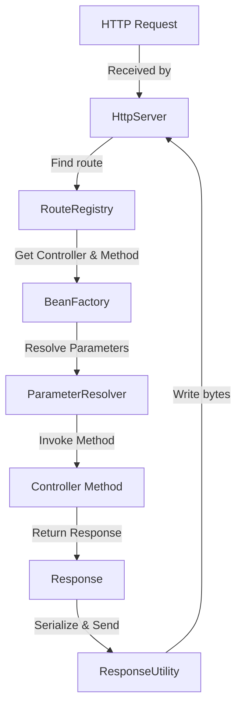

# JFastApi

**JFastApi** is a lightweight, annotation-driven Java REST framework designed for simplicity, performance, and developer
productivity. It allows you to quickly create REST APIs using minimal configuration, automatic dependency injection,
Hibernate integration, and Java virtual threads for high concurrency.

---

## Features

* **Annotation-Based Routing** – Define endpoints using `@HttpRoute` like in Spring Boot.
* **Automatic Dependency Injection** – `BeanFactory` automatically resolves and injects dependencies.
* **Hibernate Integration** – Easily use Hibernate with programmatic configuration, no `persistence.xml` required.
* **JSON Serialization** – Automatic request/response JSON handling with Jackson.
* **Virtual Threads** – Built on Java 24 virtual threads for lightweight concurrency.
* **Parameter Binding** – Supports `@RequestParam` and `@RequestBody` for clean controller methods.
* **Extensible Response Handling** – `Response<T>` class with flexible content type and headers.
* **Graceful Shutdown** – Proper shutdown hook for server termination.
* **Annotation Scanning** – Automatically discovers controllers and entities based on base package.

---

## Getting Started

### Prerequisites

* Java 24+
* Maven or Gradle
* MySQL or any JDBC-supported database (optional, for Hibernate)
* Jackson (for JSON serialization)

### Installation

Clone the repository:

```bash
git clone https://github.com/yourusername/jfastapi.git
cd jfastapi
```

Build with Maven:

```bash
mvn clean install
```

---

## Usage

### 1. Configure Application Properties

Create an `app.properties` file in `resources`:

```properties
# Server
port.number=9090
# Primary Database
app.datasource.url=jdbc:mysql://localhost:3306/db
app.datasource.username=root
app.datasource.password=secret
app.datasource.driver-class-name=com.mysql.cj.jdbc.Driver
# Hibernate settings
app.datasource.hibernate.dialect=org.hibernate.dialect.MySQLDialect
app.datasource.hibernate.show_sql=true
app.datasource.hibernate.hbm2ddl.auto=update
```

---

### 2. Initialize Application Context

```java
public class Main {
    public static void main(String[] args) {
        JFastApi.main(args);
    }
}
```

The framework automatically scans the main class package for:

* Controllers (`@HttpRoute`)
* Hibernate Entities (`@Entity`)

---

### 3. Define a Controller

```java
public class TodoController {

    private final TodoService todoService;

    public TodoController(TodoService todoService) {
        this.todoService = todoService;
    }

    @HttpRoute(path = "/todo/save", method = HttpMethod.POST)
    public Response<Map> saveTodo(@RequestBody Todo todo) {
        todoService.save(todo);
        return new Response.Builder<Map>()
                .contentType(ContentType.JSON)
                .status(HttpStatus.OK)
                .body(Map.of("message", "Todo saved successfully!"))
                .build();
    }

    @HttpRoute(path = "/todo/find-all", method = HttpMethod.GET)
    public Response<List<Todo>> findAll() {
        List<Todo> list = todoService.findAll();
        return new Response.Builder<List<Todo>>()
                .contentType(ContentType.JSON)
                .status(HttpStatus.OK)
                .body(list)
                .build();
    }
}
```

---

### 4. Define Service & Repository

```java
public class TodoService {
    private final HibernateRepository<Todo, Long> todoRepository;

    public TodoService() {
        todoRepository = new HibernateRepository<>(AppContext.getDefaultSessionFactory(), Todo.class);
    }

    public void save(Todo todo) {
        todoRepository.save(todo);
    }

    public List<Todo> findAll() {
        return todoRepository.findAll();
    }
}
```

---

## Response Handling

The framework automatically serializes objects to JSON if `ContentType.JSON` is used:

```java
Response<List<Todo>> response = new Response.Builder<List<Todo>>()
        .contentType(ContentType.JSON)
        .status(HttpStatus.OK)
        .body(todoList)
        .build();
```

---

## Advanced Features

* **Automatic DI**: Just define constructors, and dependencies are injected.
* **Annotation Scanning**: Automatically discovers `@Entity` classes and controllers.
* **Parameter Binding**: Supports `@RequestBody` and `@RequestParam` annotations.
* **Graceful Shutdown**: Server stops cleanly on JVM exit.

---

## Example Request

**POST /todo/save**

```json
{
  "id": 1,
  "title": "Learn JFastApi",
  "completed": false
}
```

**Response**

```json
{
  "message": "Todo saved successfully!"
}
```

---

## Architecture Overview

The following diagram shows the **request lifecycle** in JFastApi:



### Explanation of Flow

1. **HTTP Request**: The client sends an HTTP request to the server.
2. **HttpServer**: The built-in Java HTTP server receives the request.
3. **RouteRegistry**: Matches the request path and HTTP method to a registered controller route.
4. **BeanFactory**: Provides the controller instance, resolving constructor dependencies automatically.
5. **ParameterResolver**: Maps `@RequestBody` and `@RequestParam` annotations to method parameters.
6. **Controller Method**: Executes user-defined business logic.
7. **Response<T>**: Controller returns a typed response object.
8. **ResponseUtility**: Serializes the response (JSON or plain text) and writes it to the HTTP response.
9. **HTTP Response Sent**: Client receives the result.

---

### Key Takeaways

* **Annotation-Based**: Controllers and parameters are discovered automatically.
* **Dependency Injection**: Constructor dependencies are resolved recursively.
* **Automatic JSON Handling**: `Response<T>` can return objects, maps, or strings.
* **High Concurrency**: Virtual threads ensure minimal overhead for concurrent requests.
* **Extensible**: You can add middleware, filters, or multi-database support in the future.

---

## Future Enhancements

* Multi-database support
* Pagination & sorting in `HibernateRepository`
* Middleware support (filters/interceptors)
* OpenAPI/Swagger integration
* WebSocket support

## Contributing

1. Fork the repo
2. Create a feature branch (`git checkout -b feature/XYZ`)
3. Commit your changes (`git commit -am 'Add XYZ'`)
4. Push to the branch (`git push origin feature/XYZ`)
5. Open a pull request
